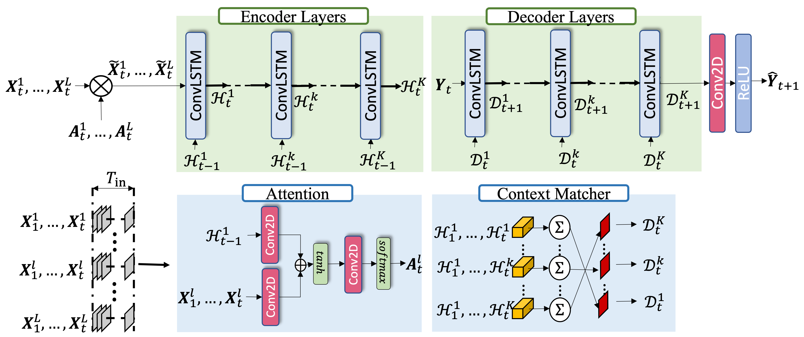

# Numerical Weather Forecasting using Convolutional-LSTM with Attention and Context Matcher Mechanisms



Contains the datasets, models, and results for the paper https://arxiv.org/pdf/2102.00696.pdf 

# Datasets
Both of the datasets 'High Resolution' and 'WeatherBench' are available in [here](https://drive.google.com/drive/folders/1Ry1x-Fv6uxtLYfgRBv-MUOLaWjK3wPO6?usp=sharing).  
After downloading the datasets extract them under `data` directory.

- highres --> data/data_dump
- weatherbench --> data/weatherbench

## Models
Download the trained models in [here]().
Put the models under `results` directory. After the extraction the models should be in this hierarchy.
- results/
  - results/highres
    - models ...
  - results/weatherbench
    - results/sequential_results/
      - models ...
    - results/iterative_results/
      - models ...
    - results/direct/
      - models ...

## Install & Run
For the installation, install the packages to a python=3.8 environment.
```
$ pip install -r requirements.txt
```

### Arranging Configs
- For Higher Resolution dataset the arguments are taken from `configs/higher_res/higher_res_config.py`.
- For WeatherBench dataset the arguments are taken from `configs/weatherbench/` according to forecast mode:
    - Sequential: `configs/weatherbench/seq_model_confs.py`
    - Iterative: `configs/weatherbench/iter_model_confs.py`
    - Direct: `configs/weatherbench/direct_model_confs.py`

these configuration scripts are overwriting the default parameters that are defined in `config.py` and `config_generator.py`

### Training and Testing

The `run.py` script contains a main function for training and testing as shown in below:
```
if __name__ == '__main__':
    run(dataset="weatherbench",
        model_name="weather_model",
        exp_type="sequential",
        perform_training=True)
```

### Reproducing the Paper's Outputs
We are also reproducing the outputs of the paper including table and figures in `run.ipynb`.
